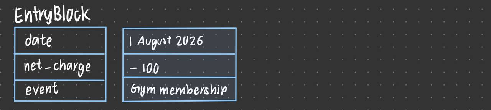
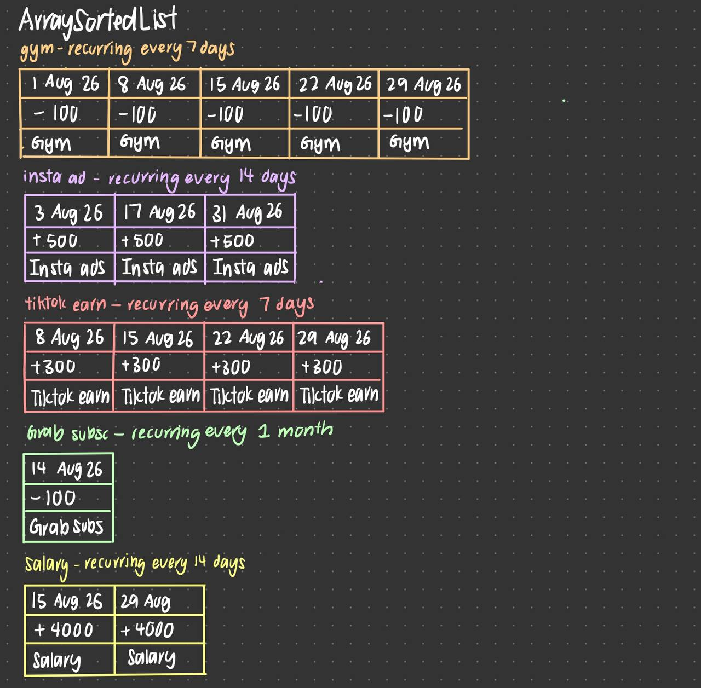
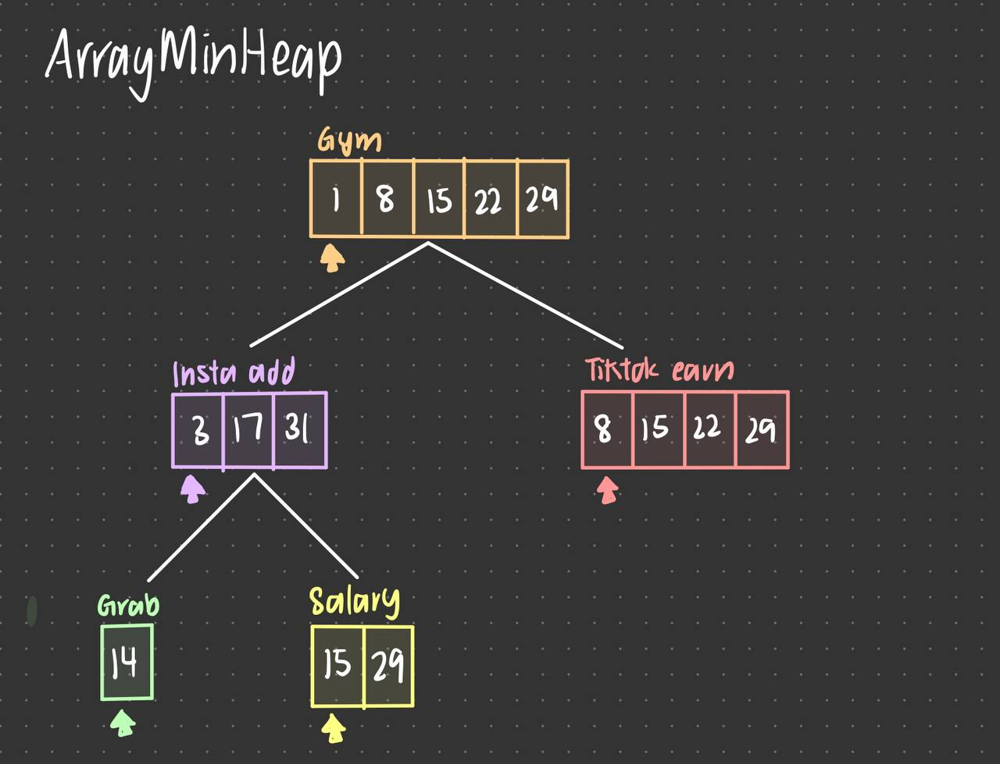
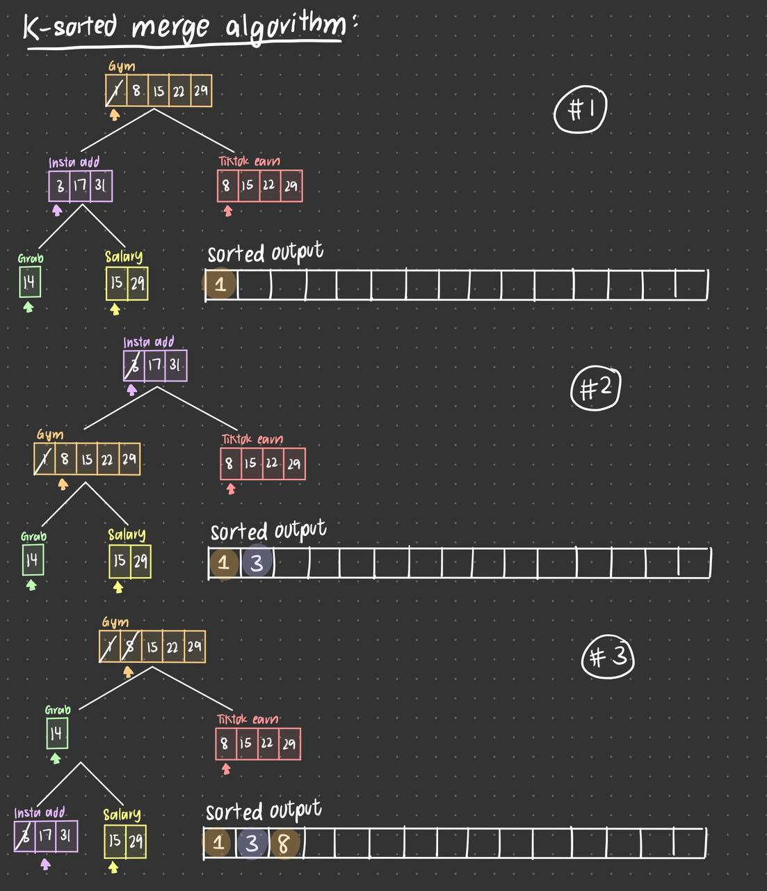
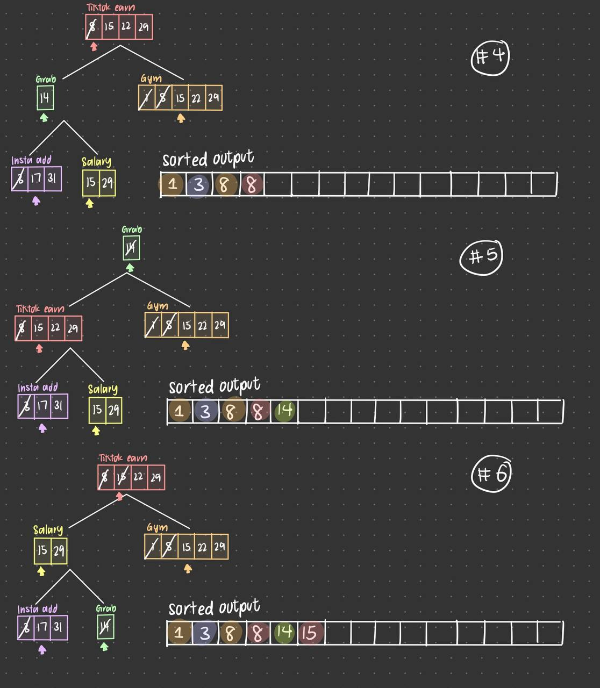
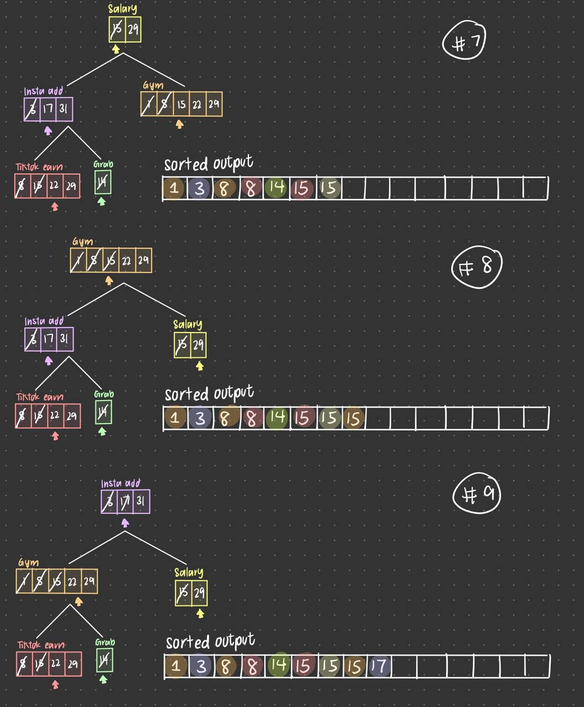
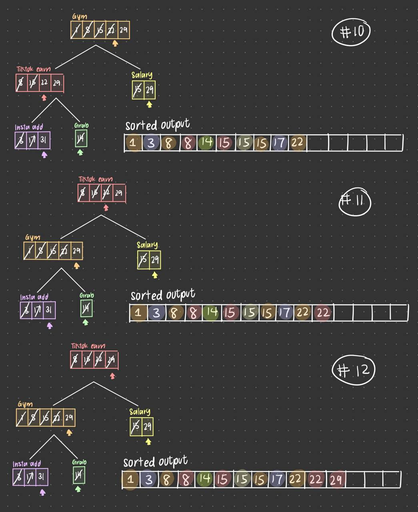
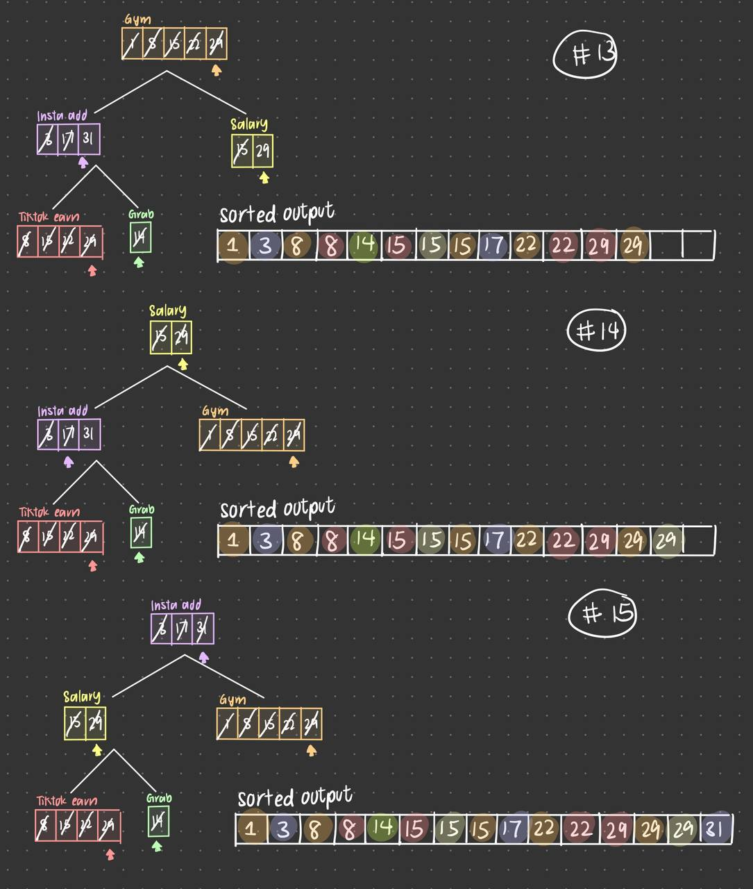

# Data Structure and Algorithms

## 1. EntryBlock
- Represent a block of [event, date, net_charged (negative or positive)]

## 2. ArraySortedList 
- SortedList to stores a list of EntryBlock.
- Value is representted by EntryBlock's date field in ascending order.
- When inserting in a new EntryBlock, binary search via __index_to_add() determines where to add the new EntryBlock in O(logN), N is number of recurring charge date.
- Has a pointer that initialised to first element and can be incremented via increment_pointer(). This will be used in k_sorted_lsit_merge() algorithm.
- Last element is always None / INF so that when pointer done iterating the ArraySortedList, it can be pushed to bottom-most of ArrayMinHeap in k_sorted_list_merge().

## 3. ArrayMinHeap
- Minimum heap where each 'node' represent an ArraySortedList.
- Heap property is maintained based on the current pointer of each ArraySortedList. 

## 4. Determine recurring date in determine_charge_date(event, cycle)
- Based on cycle value (eg: 7 days, 14 days, 1 month, 3 month, 1 year, customised days), generate a list of date of when will recurring charge be imposed on for this event.

## 5. K-sort merge in k_sorted_list_merge(list of k sorted list) forecast_engine.py
- k_sorted_list_merge() receive a list of ArraySortedList, with pointer initialised to the first element
- Then, append each sorted_list into a ArrayMinHeap.
- Now, we extract_root() of the pointer pointed EntryBlock of top most ArraySortedList in heap. 
- Since is the extracting is from an ArrayMinHeap, the data structure will maintain its heap property via sink() or rise(). 
- Final extracted list is a sorted list of all EntryBlock based on date.
- Iterating every recurring charge date from all events is O(N), where N is the number of charges and maintaining heap property via sink() and rise() is O(logK), where K is number of recuring events.
- Final returns a list of all EntryBlock, where they are sorted based on date
- Overall complexity is O(N*logK) instead of naive approach of O(N * K)

## 6. Determine balance in determine_balance(sorted list from k_sorted_list_merge()) forecast_engine.py
- Iterate and to find net balance on each day within forecast window.

## 7.Example
- Amanda has 5 recurring charge and income: 
[gym, every 7 days, -100], 
[xhs_income, every 14 days, +50],
[spotify, every 10 days, -50],
[car_loan, every month, -1000],
[monthly_salary, every month, +4000]
- Amanda selected forecast window of 2 months on 1 Mar.
- For each recurrance event+date, determine_charge_date(event, date) will generate the relevant date that falls in the forecast window.
- k_sorted_list_merge() will merge up all to compute the final list containing all [event, charged_date, recurring_charge].
- From here, she can see her remaining balance of each day within her selected forecast window via determine_balance().
- eg: [
    [gym, 1Mar, -100], 
    [xhs_income, 3Mar, +50],
    [spotify, 4Mar, -50],
    [monthly_salary, 7Mar, +4000],
    [gym, 8Mar, -100],
    [spotify, 14Mar, -50],
    [gym, 15Mar, -100], 
    [xhs_income, 17Mar, +50],
    [car_loan, 18Mar, -1000],
    [gym, 22Mar, -100],
    [spotify, 24Mar, -50],
    [gym, 29Mar, -100], 
    [xhs_income, 31Mar, +50],
    [spotify, 3Apr, -50],
    [gym, 5Apr, -100],
    [monthly_salary, 7Apr, +4000],
    [gym, 12Apr, -100], 
    [spotify, 13Apr, -50],
    [xhs_income, 14Apr, +50],
    [car_loan, 18Apr -1000],
    [gym, 19Apr, -100], 
    [spotify, 23Apr, -50],
    [gym, 26Apr, -100], 
    [xhs_income, 28Apr
    , +50],
]

