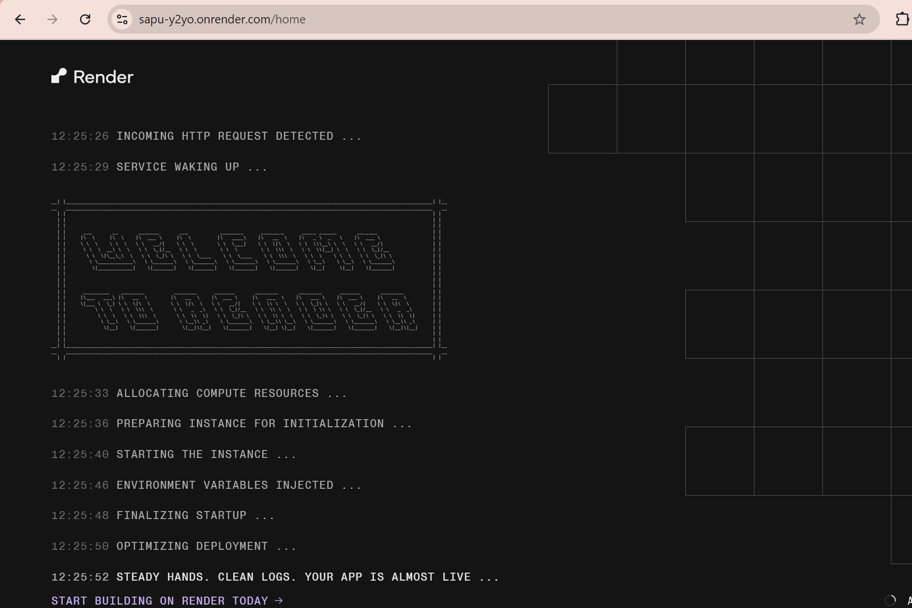
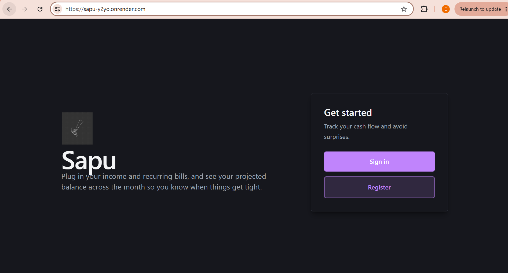

# Sapu - Cash-Flow Forecaster App

## 💸 About Sapu
Sapu is a simple Cash-Flow Forecaster that allows user to keep track of any recurring bill or income in their account, project their future forecast by customising their forecast window days, threshold (minimum amount to keep user out of finanacial risk) and starting balance (how much user have of today).

With Sapu, user can plug in their income and recurring bills, and see your projected balance across the month so they know when things get tight, meaning in financial risk.

## 💪 Core Feature
- Add income and recurring expenses and a forecast view.
- Highlight challenge of Sapu -- since bills and income land on different cycles (custom days, weekly, monthly, annual) and the useful output is the exact day your balance dips lowest. 
- Modelling those overlapping cycles correctly is where it lives.

## 📄 Documentation
Design documentation containing design rational, planning, feature flow, tech stacks and AI usage can be found at Google Docs: [Sapu Documentation](https://docs.google.com/document/d/1Qxr0YDOFBjIPZxOTdCWygYJ3QYKYt6FaYZA0EDWVQbE/edit?usp=sharing)

## 🧪 Testing
Design documentation containing design rational, planning, feature flow, tech stacks and AI usage can be found at Google Docs: [Sapu Test Documentation](https://docs.google.com/document/d/1xShSBh4TBxqXldxqSRcIy0bmzmHzgEJQ72lbTnNBbnQ/edit?usp=sharing)

## 🚀 Live Hosting on Render
[Sapu - Cash Flow Forecaster](https://sapu-y2yo.onrender.com/)

It is normal to see a some Render logs  before loaded to the landing page


## 🔨 Tech Stack

Sapu is built on the **FARM stack** (FastAPI, React, MongoDB), with JWT-based authentication and a lightweight Vite-powered frontend.

### Backend
| Layer | Technology |
|-------|------------|
| Language / Runtime | Python 3.11.6 |
| Web Framework | FastAPI 0.111.0 |
| ASGI Server | Uvicorn 0.29.0 |
| Database | MongoDB |
| ODM | Beanie 1.26.0 (async, on top of Motor 3.6.0) |
| Data Validation | Pydantic 2.8.2 |
| Authentication | JWT via `python-jose[cryptography]` 3.3.0 + `bcrypt` 4.1.3 |
| Configuration | `python-dotenv` |

### Frontend
| Layer | Technology |
|-------|------------|
| Framework | React 19 |
| Build Tool | Vite 8 |
| Routing | React Router DOM v7 |
| State Management | Zustand |
| HTTP Client | Axios |
| Icons | Lucide React |
| Notifications | React Hot Toast |
| Charts | Recharts |
| Linting | ESLint 10 |

### Others
| Layer | Technology |
|-------|------------|
| Deployment | Render |
| Testing | Manual API Testing on Postman |

## 🏡 How to run this project locally?

> **Prerequisites**: Python 3.11+, Node.js 18+, and a MongoDB cluster (e.g. a free [MongoDB Atlas](https://www.mongodb.com/atlas) cluster).

### 1. Clone the repository
```bash
git clone <repo-url>
cd sapu
```

### 2. Set up the backend
```bash
cd backend
python -m venv venv
# Activate the virtual environment:
#   Windows:  venv\Scripts\activate
#   macOS/Linux:  source venv/bin/activate
pip install -r requirements.txt
```

Create a `.env` file in `backend/` with the following variables:
```env
MONGO_URI=<your-mongodb-connection-string>
JWT_SECRET=<any-random-secret-string>
# Optional (with defaults shown):
# JWT_ALGORITHM=HS256
# JWT_EXPIRE_MINUTES=1440
# FRONTEND_URL=http://localhost:5173
```
You can get your-mongodb-connection-string from the [MongoDB Atlas website](<your-mongodb-connection-string>).


Start the backend server:
```bash
uvicorn main:app --reload
```
The API will be available at `http://localhost:8000/api`.

### 3. Set up the frontend
Open a new terminal, then:
```bash
cd frontend
npm install
npm run dev
```
The frontend will be available at `http://localhost:5173`.

### 4. Use the app
- Open `http://localhost:5173` in your browser.
- Register a new account (password requires uppercase, lowercase, and a special character).
- Log in, add your recurring income/expenses, and generate a forecast.

## 🤔 Potential Enchancement
1. Implement the Chart tab to visualise user's forecast. Data visualisation enchances user experience on the app.
2. Implement wallet feature. As of now, use have to manually key in their "starting balance" everytime they generate a forecast, which is troublesome and repetitive, it is a good idea to maintain a wallet for every user account, that accumulates their income / bill as time goes.
3. Implement a One-Time Entry on top of the current the Recurring-Entry. This simulate a more realistic forecaster as any user will definitely have random one-time income once in a while (eg: angpao, gifts, bonus, jackpot).
4. Implement automated testing via pytest, unitest. Integrate into GitHub CI/CD pipeline to reduce repetitive manual testing via Postman.
